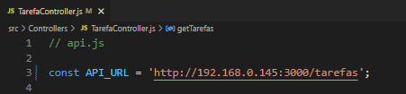
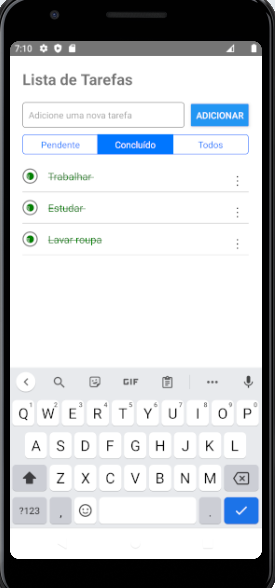
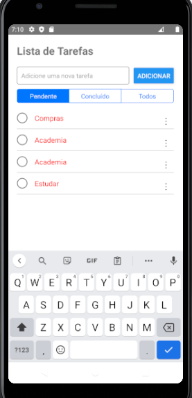
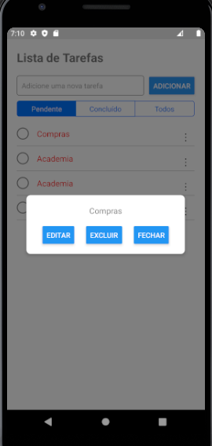
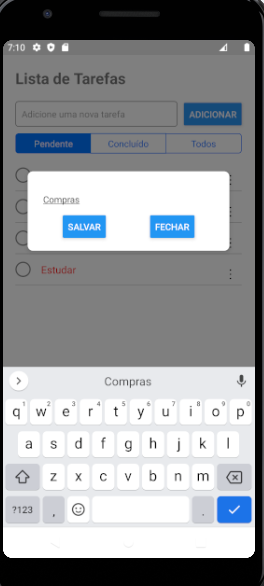
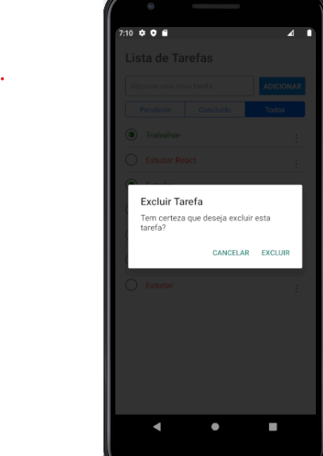
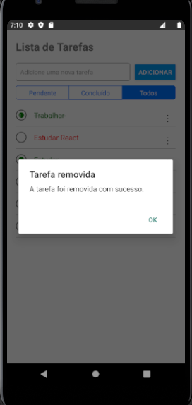

# Como iniciar o projeto :
Pré-requisito : Ter Configurado o ambiente de desenvolvimento https://reactnative.dev/docs/environment-setup?platform=android&os=windows
</br>
</br>
versão do node usada no projeto : v18.17.0
# Passo 1: Navegue até o diretório desejado

Navegue até o diretório onde deseja que o projeto seja clonado. Use o comando cd (Change Directory) seguido do caminho para o diretório desejado. Por exemplo, se você deseja clonar o projeto na pasta "Documentos":

# Passo 2: Clone o repositório
 
Abra um terminal no diretório que vai ser clonado e execute o seguinte Exemplo:
```bash
# exemplo 1:
git clone https://github.com/wendellsantos2/Desafio_Tarefas_React_native.git
```
# Passo 4: Acesse a pasta do projeto
Após a conclusão do clone, navegue para a pasta do projeto recém-clonado usando o comando cd Por exemplo:
```bash
# exemplo 1:
cd Desafio_Tarefas_React_native
```
# Passo 5: Instale as dependências
Execute o seguinte comando a partir da raiz do seu projeto React Native:

```bash 
# usando gitbash:

npm install 
```
# Passo 6: Iniciando o App
No mesmo terminal execute o seguinte comando a partir da raiz do seu projeto React Native:

```bash
# usando android:
npm run android

# usando IOS:
npm run ios
 ```

# Passo 7: instalando o json server
abra um novo terminal e execute o seguinte codigo
```bash
# usando npm :
 npm i json-server
 ```
# Passo 8: Iniciando conexão com json server db.json

No mesmo terminal execute o seguinte comando a partir da raiz do seu projeto React Native usando o comando :

```bash
# exemplo 1:
json-server --watch db.json --host localhost --port 3000

# exemplo 2:
json-server --watch db.json --host http://SEUIPAQUIII  --port 3000
 ```


 # Passo 9: Ajustando IP da sua máquina para integrar o db.json ao seu aplicativo 

```bash
# exemplo 1:
 
 ```

Se tudo estiver configurado corretamente, você verá seu novo aplicativo sendo executado no seu Emulador Android ou Simulador iOS em breve, desde que você tenha configurado seu emulador/simulador corretamente.


 


 
 








